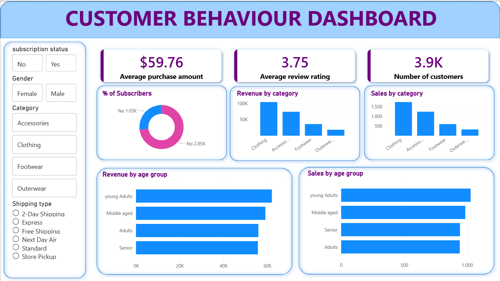

📊 Customer Behavior Analysis

  

🚀 Project Overview

This project performs Exploratory Data Analysis (EDA) on customer shopping data to uncover patterns in purchasing behavior, customer demographics, and revenue distribution.

The goal is to convert raw data into actionable business insights that can improve marketing strategies, customer targeting, and overall sales performance.

🎯 Business Problem

Businesses often struggle to understand:

Who their most valuable customers are
Which products generate the most revenue
How demographics affect purchasing behavior

This project analyzes customer data to solve these problems and enable data-driven decision making.

📁 Dataset Description

The dataset includes:

👤 Customer demographics (Age, Gender)
🛍️ Product categories (Clothing, Accessories, Footwear, Outerwear)
💰 Purchase amounts
⭐ Review ratings
📦 Subscription status
🎯 Discount & promo usage

📌 Dataset is included in the repository.

🛠️ Tools & Technologies
Python
Pandas, NumPy → Data processing
Matplotlib, Seaborn → Visualization
Jupyter Notebook → Analysis
📊 Dashboard Summary

The dashboard provides key performance indicators:

💰 Average Purchase Amount: $59.76
⭐ Average Rating: 3.75
👥 Total Customers: 3.9K
Visual Insights:
Subscription distribution
Revenue by category
Sales by category
Revenue by age group
Sales by age group
🔍 Key Insights
Customers aged 36–50 are the most active buyers
Male customers (~68%) generate the majority of revenue
Clothing (44.5%) and Accessories (31.8%) dominate sales
Most products receive high ratings (4–5)
Revenue is concentrated in specific customer segments
💡 Business Recommendations
🎯 Focus marketing on high-value age group (36–50)
👩 Improve engagement strategies for female customers
📦 Prioritize Clothing & Accessories inventory
⭐ Promote high-rated products for better conversion
💸 Optimize discount usage to maintain profit margins
📂 Project Structure
Customer-Behavior-Analysis/
│
├── data/                  # Dataset files
├── notebooks/             # Jupyter Notebook
├── dashboard.png          # Dashboard image
└── README.md
▶️ How to Run the Project
# Clone the repository
git clone https://github.com/your-username/Customer-Behavior-Analysis.git

# Navigate into the project
cd Customer-Behavior-Analysis

# Install required libraries
pip install pandas numpy matplotlib seaborn

# Run Jupyter Notebook
jupyter notebook
📈 Skills Demonstrated
Data Cleaning & Preprocessing
Exploratory Data Analysis (EDA)
Data Visualization
Business Insight Generation
Analytical Thinking
🔮 Future Improvements
Customer segmentation using RFM analysis
Predictive modeling using Machine Learning
Interactive dashboard using Power BI / Tableau
Real-time analytics integration
👨‍💻 Author

Shivansh Singh
B.Tech CSE | Aspiring Data Analyst

⚠️ Important Notes
Make sure your image is named exactly: dashboard.png
Place it in the root folder of your repository
Otherwise, GitHub won’t display it
